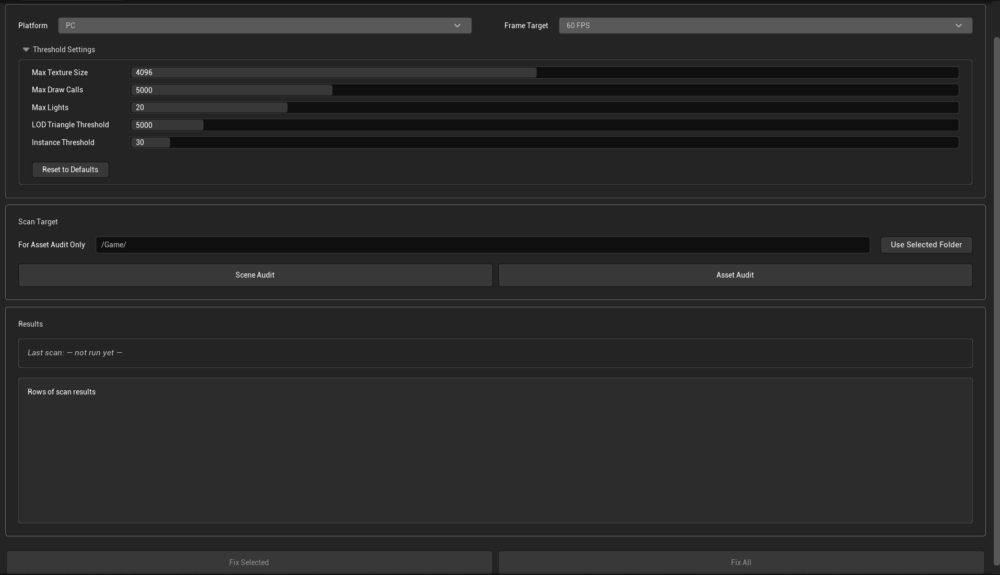
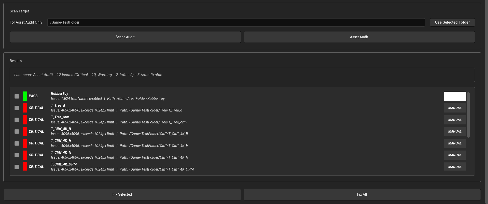
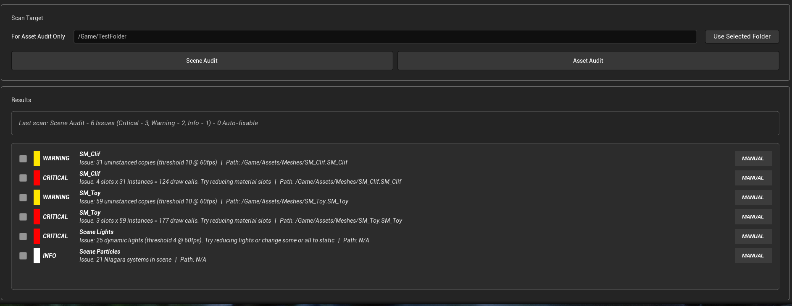

# UE5 Optimization Auditor

**Status:** Complete

An Editor Utility Widget for Unreal Engine 5.7 that audits scenes 
and assets for common performance issues, with platform-aware 
thresholds and automated fixes where safe.

See [SPEC.md](SPEC.md) for the full design specification.

## Planned Features

- Scene Audit - instancing opportunities, draw call cost, 
  dynamic light count
- Asset Audit - missing LODs, Nanite candidates, oversized 
  textures, incorrect sRGB settings
- Platform presets (PC / Console / Mobile) with editable thresholds
- Frame budget awareness (30/60/120 FPS)
- Auto-fix for safe operations, clear recommendations for 
  artist-judgement issues

## Current Progress

- [x] Full UI shell built (Editor Utility Widget)
- [x] Platform preset system with editable thresholds
- [x] Reusable result row widget with severity color coding
- [x] Scene Audit logic
- [x] Asset Audit logic (Nanite/LOD, texture size, sRGB, mipmaps)
- [x] Fix operations (generate_lods, enable_nanite, fix_srgb_off, enable_mipmaps)
- [x] Fix Selected and Fix All wired and tested
- [x] Demo video

## Demo

[Watch the full walkthrough](https://www.youtube.com/watch?v=jmYudNmXkxI) - Asset Audit and Scene
Audit scanning a test project, Fix Selected and Fix All resolving flagged
issues, and a re-audit confirming the fixes actually resolved the problems.

## Installation

### Option 1: Migrate (Recommended)
1. Open this project in Unreal Engine 5.7
2. In the Content Browser, locate `EUW_OptimizationAuditor`
3. Right click > Asset Actions > Migrate
4. Select your project's Content folder as the destination
5. Unreal will copy the tool and all dependencies automatically

### Option 2: Manual Copy
1. Copy the `Content/OptimizationAuditor/` folder from this 
   repo into your project's Content folder
2. Reopen your project in Unreal
3. Right click `EUW_OptimizationAuditor` > Run Editor Utility Widget

## Testing the Tool

This repo does not include sample test assets due to third-party 
licensing. To test the tool yourself:

1. Import any Static Mesh assets into your project
2. Place multiple copies of the same mesh in a level (uninstanced)
3. Add several dynamic lights
4. Run Scene Audit and Asset Audit to see the tool flag issues

## Requirements
- Unreal Engine 5.7+
- Python Editor Script Plugin enabled
- Editor Scripting Utilities plugin enabled

## Built With

- Unreal Engine 5.7
- Blueprint
- Python

## Screenshot

